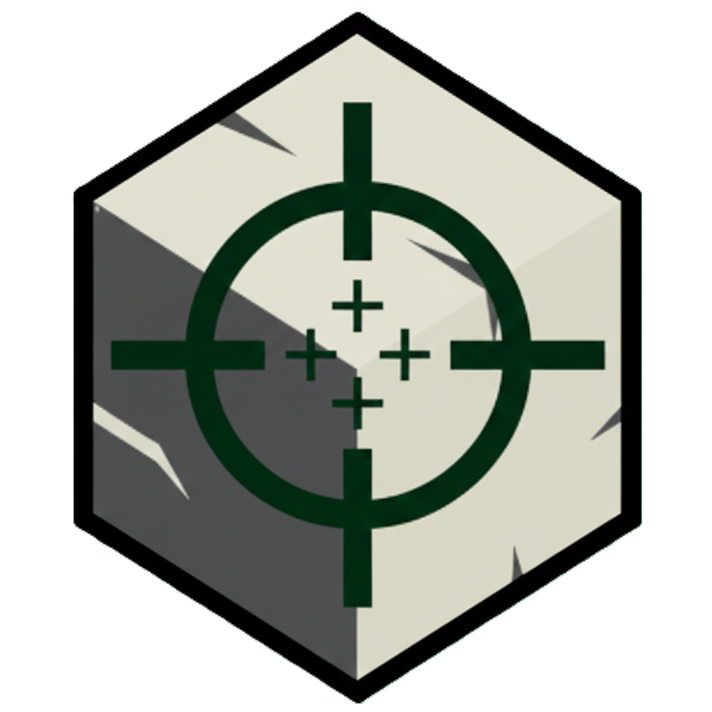

<p align="center">
  
</p>

# Min. At. Zero Web Client

Min. At. Zero의 정적 웹 클라이언트입니다. 전용 클라이언트 프로토콜 호출, 서버 상태, 랭킹, 맵, 위키, 조작법과 패치 노트를 제공합니다.

## 로컬 실행

Node.js 18 이상만 있으면 별도 패키지 설치 없이 실행할 수 있습니다.

```powershell
npm run dev
```

브라우저에서 `http://127.0.0.1:4173`을 엽니다. 포트를 바꾸려면 `PORT` 환경 변수를 지정합니다.

## 변경 전 점검

```powershell
npm run check
```

이 명령은 전체 HTML의 필수 메타데이터, 중복 ID, 잘못된 로컬 파일 경로, 외부 링크 보안 속성, JavaScript 문법과 JSON 형식을 검사합니다. 다운로드 대상별 안내와 서버 상태 갱신 실패 처리도 함께 검증합니다.

## 구조

- `asset/style.css`: 기존 공통 컴포넌트와 레이아웃
- `asset/theme.css`: 현재 색상, 타이포그래피, 표면 스타일
- `asset/script.js`: 공통 동작과 외부 API 설정
- `asset/header.html`, `asset/footer.html`: 모든 페이지가 공유하는 레이아웃
- `controls/`, `developer/`, `map/`, `wiki/`: 페이지별 정적 데이터와 미디어
- `scripts/`: 로컬 서버와 자동 점검 도구
- `sw.js`: PWA 오프라인 캐시

운영과 배포 시 확인할 항목은 [유지보수 가이드](docs/MAINTENANCE.md)를 참고하세요.

## 외부 서비스

- Supabase REST API: 플레이어 랭킹
- GitHub API: 클라이언트 릴리스와 패치 노트
- `mc-heads.net`: Minecraft 플레이어 아바타
- `mcsrvstat.us`: Minecraft 서버 상태

Supabase 키는 브라우저용 publishable 키이며 읽기 전용 정책을 전제로 합니다. 쓰기 권한이나 서비스 역할 키를 프론트엔드에 넣으면 안 됩니다.
