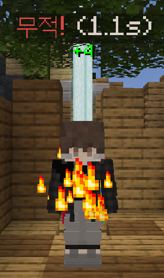
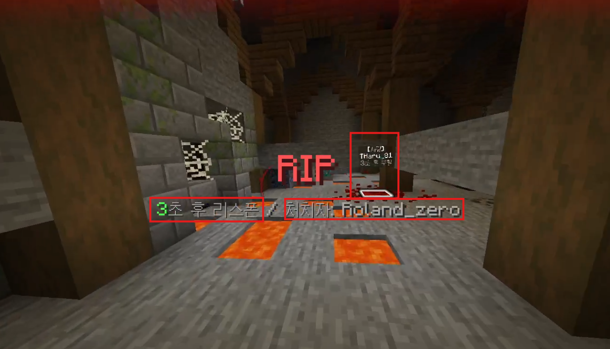

# 생명

---

## 1-1. 채력 재생

피해를 입으면 7초 동안 전투상테에 진입합니다.

남은 카운트는 인벤토리 위 경험치바에서 확인 가능합니다.

7초 안에 또다시 피해를 입을 경우 다시 7초로 초기화 됩니다.

7초가 지난후에는 채력이 서서히 회복됩니다.

## 1-2. 무적

무적(저항 255레벨) 일 경우 플레이어에게 시각적인 효과를 표시합니다.

무적 상테에서 적에게 공격을 받을 경우 자신을 공격한 대상에게 자신은 무적상테라고 알립니다.

만약 자신이 무적상테일 경우 대상을 공격하면 무적상테가 해제됩니다.

이 무적 효과를 부활시 3초동안 유지됩니다.

## 1-3. 부활 및 데스켐

사망시 마인크래프트상에서는 즉시 부할하며, 이미지와 같은 화면이 표시됩니다.

화면 중앙테 Title이 표시되고 왼쪽에는 부활까지 남은 카운트, 오른쪽에는 자신을 죽인 처치자가 표시됩니다.

그리고 사망시에는 관전자 모드가 되어 이미지와 같이 처치자 시점으로 이동하게 됩니다. (위 이미지는 상대 시점 맞음) 그리고 사망시에는 사망한 자리에 이미지와 같이 표시됩니다. 이 표시는 모든 플레이어에게 나옵니다.
