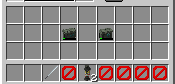

# 인벤토리

---

## 5-1. 설명

3번 슬롯은 근접무기, 4번 슬롯은 선택한 투척무기입니다. 인벤토리에 있는 아이템은 선택한 탄약 상자입니다.

---

### 5-1-1. 근접무기

### 단검

### 카림빗

### 배트

총을 들면 이속이 느려 답답하시다구요?

여기 아주 품질이 좋은 근접무기이 있습니다!

근접무기를 들면 신속 1레벨이 부여되기 때문에 이동할때 매우 유용합니다.

또는 근접 상황에서 서로 총을 쐈는데 둘다 ㅂ신이여서 못 맞추고 총알을 다 쓴 경우 단검으로 죽여도됩니다.

플레이어들 끼리 칼전을 해도 재미있습니다! *~~이거 암살당하면 진짜 기분 나쁨~~*
