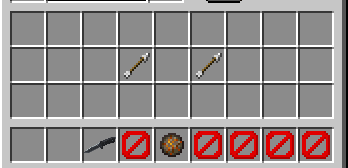
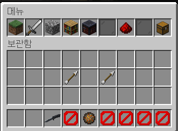
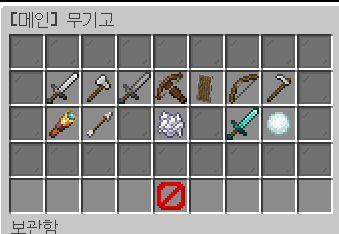
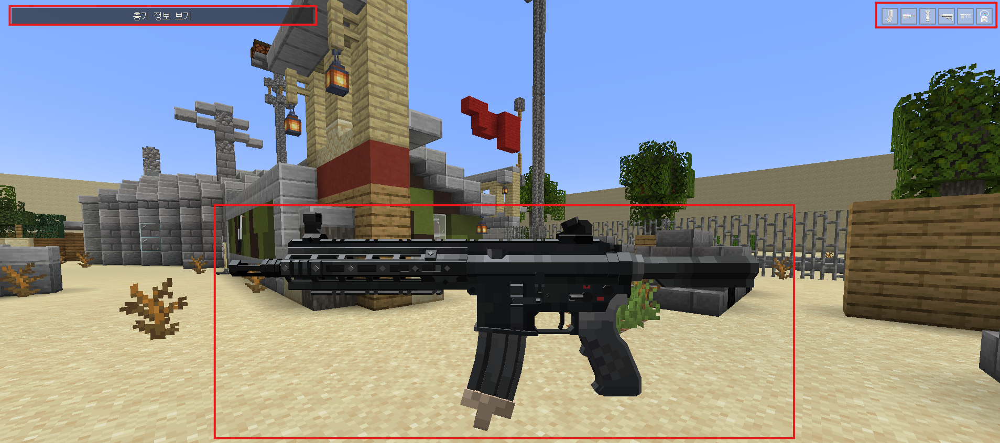
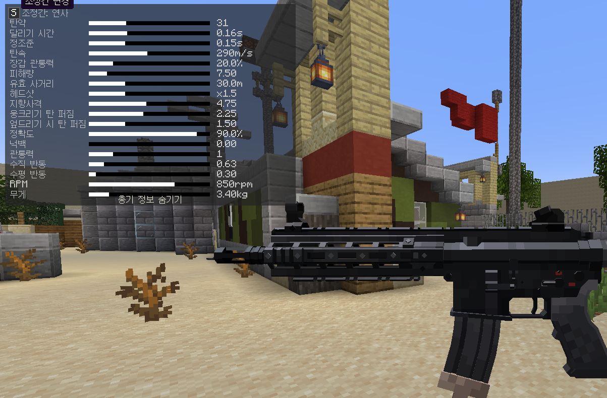
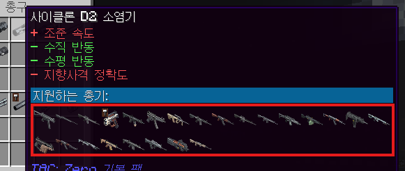
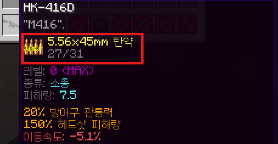
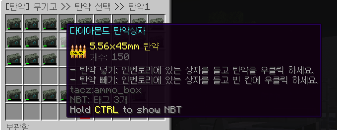

# 무기 세팅하기

서버에 처음 접속하시면 현재 인벤토리는 아래와 같이 되어있을것입니다.

인벤 안에 있는 화살은 선택한 탄약슬롯이고요, 하단에 단검은 선택한 근접무기가 표시되고, 5번 슬롯애 화염구는 선택한 투척무기입니다. 탄약슬롯에 화살은 아무것도 선택하지 않아서 뜨는거고, 화염구도 마찬가지로 선택하지 않아서 뜹니다. 선택해보죠.

# 장비 세팅

1. `(웅크리기) + F` 키를 눌러 메뉴에 진입합니다.
2. 중앙에 무기고를 클릭합니다.

    

3. 여기서 각각 파츠는 망안경, 화살은 탄약, 다이야검은 근접무기, 눈덩이는 투척무기입니다. 각각 클릭해서 원하는 장비를 맞추시면 됩니다. 일단 여기서는 파츠와, 탄약, 근접무기만 알아봅시다

    

## 총

일단 총게임이니 총을 받아봅시다.

상단에 무기들인데요. 다양하죠? FPS가 처음이 아니라면 익숙하지만 아니신분들을 위해 설명해 드릴게요.

### AR

한국어로 돌격소총이라고 합니다.

이 무기들은 대부분 30발이 기본 탄창이고, 대부분의 교전에 적합합니다.

### DMR

AR과 비슷하지만 다릅니다.

대부분 탄창수가 적고, 반동이 심하지만 한발 대미지가 강합니다. 대부분 중거리, 원거리에 적합하죠.

몇몇총가를 연발도 가능하지만, 반동이 심해 초심자에게는 연발을 추천드리지 않습니다.

### SMG

한국어로 기관단총이라고 합니다.

대부분 총기들이 탄창추가 AR보다 많거나 같습니다. 대미지를 AR비해 낮지만 빠른 연사력 또는 적은 반동이 장점입니다.

대부분 근거리, 중거리에 적합합니다.

### 샷건

훌륭한 대화수단입니다. 유명하니 말은 안하겠습니다.

### 중화기

대부분 화력이 강한 무기를 중화기라고 합니다. 무겁고, 반동이 심하지만 그만큼 위력이 강력합니다. 탄창수도 많고요.

### SR

저격총이라고 하면 쉽죠? 저격총입니다.

### 권총

작고, 가벼워서 주무기에 탄약이 부족하거나 급한 상황에서 임시 방편으로 사용하는 총기입니다.

## 파츠

총을 선택했으면 파츠를 맞출 차례입니다. 파츠가 무슨 역할이냐고요?

파츠는 총기를 보조하는 장비입니다. 예를 들어 반동을 줄이거나 반동중에서도 수직, 수평 반동을 줄아거나, 조준 속도를 높히거나, 정확도를 높아거나… 다양합니다. 하지만 장점이 있으면 단점도 있겠죠? 반동이 늘어난다던가, 무거워서 이동속도가 느리다던가, 정확도가 낮아진다던가….. 많습니다.

한번 장착해보죠. 저는 일단 AR 에 HK-416D를 예시로 알려드릴게요.

총가를 들고 `T`를 누르면 이미지와 같이 파츠 장착 화면이 표시됩니다.

왼쪽 위 버튼들은 파츠 선택 버튼이고요, 오른쪽에 버튼을 누르면

이미지와 같이 다양한 스텟이 나옵니다. 여기 값도 파츠를 장학하면 변경되서 보입니다. 참고하세요!

총마다 장착할 수 있는 파츠가 다양합니다. 그레서 이걸 쉽게 하는 방법은

특정 파츠 위에 마우스를 올리고 Shift 를 누르면 이미지와 같이 지원하는 총기가 뜹니다.

여기에 맞춰서 파츠를 장착해 보세요!

## 탄약

탄약은 총 슬롯이 2개입니다.

쉽게 슬롯 1개는 주무기 탄약, 나머지 1개는 보조무기 탄약으로 맞추시면 됩니다.

각 총기의 탄약을 알아내는 방법은

이미지와 같이 총에 마우스를 올려 뜨는 정보를 보시고

선택하시면 됩니다.

## 근접무기

근접무기를 3개다 장단점이 있습니다.

단검은 밸런스가 잡혀있고,

카람빗은 공격속도가 빠르고, 이속이 빠른 대신, 짧은 사거리와 데미지가 낮고,

배트는 공격력아 강하고, 사거리가 길지만, 공격 속도가 느리고, 이속이 느린 장점이 있습니다.

이거는 취향에 맞게 골라주세요!
